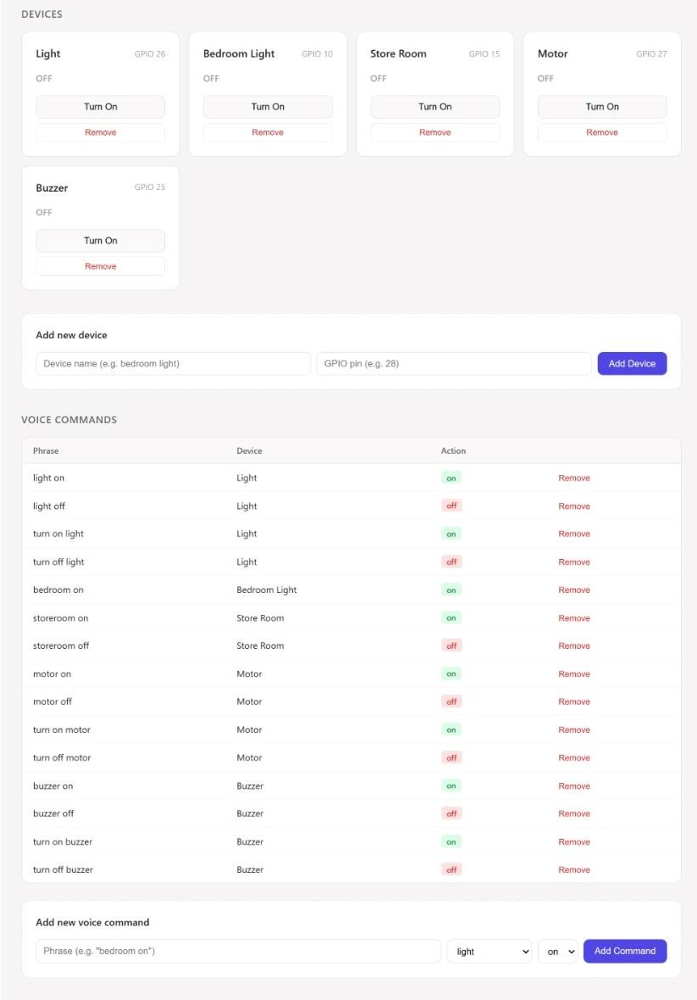
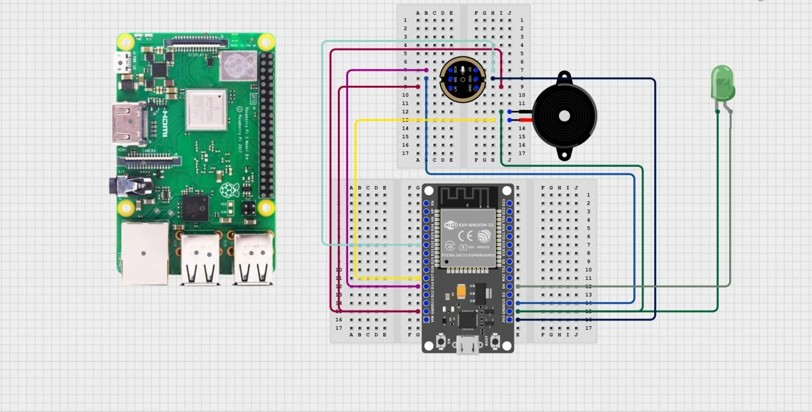

#  Offline Voice Controlled Smart Home IoT

An AI-powered **Offline Voice Controlled Smart Home Automation System** built using **Raspberry Pi 3**, **ESP32**, **Vosk Speech Recognition**, and **MQTT**. The system processes voice commands locally without requiring an internet connection, providing a fast, secure, and privacy-focused smart home solution.

---

##  Project Overview

This project enables users to control home appliances through voice commands without relying on cloud-based speech recognition services.

The Raspberry Pi continuously listens for voice commands through an **INMP441 digital microphone**, recognizes speech using the **Vosk Offline Speech Recognition Model**, and publishes control messages to the MQTT broker. The ESP32 receives these commands and controls the connected devices accordingly.

A web-based dashboard allows users to monitor and control the devices in real time over the local network.

###  Features

-  Offline Speech Recognition using Vosk
-  Voice Controlled Smart Home Automation
-  MQTT Based Communication
-  ESP32 Device Control
-  Real-Time Dashboard Monitoring
-  No Internet Required
-  Fast Response Time
-  Raspberry Pi Based Processing

---

#  Hardware Prototype

<p align="center">

</p>

---

# Dashboard Monitoring

<p align="center">

</p>

---

#  Circuit Diagram

<p align="center">

</p>

---

#  How the System Works

1. User speaks a predefined voice command.
2. INMP441 microphone captures the audio.
3. Raspberry Pi processes the speech using the Vosk Offline Speech Recognition model.
4. The recognized command is matched with predefined automation commands.
5. Raspberry Pi publishes the command to the MQTT Broker.
6. ESP32 receives the MQTT message.
7. ESP32 controls the connected appliance.
8. Dashboard updates the device status in real time.

---

#  Hardware Components

| Component | Image |
|-----------|-------|
| Raspberry Pi 3 |  |
| ESP32 Dev Kit |  |
| INMP441 Microphone Module |  |

---

#  Project Structure

```text
Offline-Voice-Controlled-Smart-Home-IoT
│
├── backend
│   ├── server.py
│   └── requirements.txt
│
├── docs
│   ├── actual circuit prototype.jpg
│   ├── Circuit.jpg
│   ├── Deshboard-Monitoring.png
│   ├── ESP 32 DEV KIT.png
│   ├── Esp serial terminal output.png
│   ├── INMP441 Microphone Module.jpg
│   ├── Raspberry Pi 3 Board.png
│   ├── Raspberry pi 3 terminal output - server running.jpg
│   └── Raspberry pi 3 terminal output - speech-recognition run.jpg
│
├── firmware
│   ├── esp32_voice_controller.ino
│
├── frontend
│   └── dashboard.html
│
├── models
│   └── vosk-model-small-en-us-0.15
│
├── speech
│   └── speech_recognition.py
│
├── Makefile
├── requirements.txt
├── LICENSE
└── README.md
```

---

#  Installation

## 1️⃣ Clone Repository

```bash
git clone https://github.com/mohitvanzara/Offline-Voice-Controlled-Smart-Home-IoT.git

cd Offline-Voice-Controlled-Smart-Home-IoT
```

---

## 2️⃣ Create Python Virtual Environment

```bash
python3 -m venv .venv
```

Activate Virtual Environment

Linux

```bash
source .venv/bin/activate
```

Windows

```powershell
.venv\Scripts\activate
```

---

## 3️⃣ Install Project Dependencies

```bash
pip install -r requirements.txt
```

---

## 4️⃣ Install Backend Dependencies

```bash
pip install -r backend/requirements.txt
```

---

## 5️⃣ Offline Speech Recognition Model

This project uses the **Vosk Offline Speech Recognition Model**.

The model is already included inside the project.

```text
models/
└── vosk-model-small-en-us-0.15
```

No additional download is required.

---

#  Running the Project

Run using Makefile

```bash
make install
```

```bash
make run
```

Or manually

Start Backend Server

```bash
python backend/server.py
```

Start Speech Recognition

```bash
python speech/speech_recognition.py
```

---

#  Raspberry Pi Server Output

<p align="center">

</p>

---

#  Speech Recognition Output

<p align="center">

</p>

---

#  ESP32 Serial Monitor

<p align="center">

</p>

---

#  Technologies Used

- Python
- Flask
- HTML
- JavaScript
- MQTT
- ESP32
- Raspberry Pi 3
- Vosk Speech Recognition
- Socket.IO
- Makefile

---

#  Conclusion

This project demonstrates a complete offline AI-powered smart home automation system capable of recognizing voice commands locally and controlling IoT devices in real time.

By combining Raspberry Pi 3, ESP32, MQTT, and the Vosk Offline Speech Recognition Engine, the system delivers a reliable, fast, and privacy-focused automation solution without depending on cloud services.

---

#  License

This project is licensed under the **MIT License**.

See the **LICENSE** file for more information.

---

##  Author

**Mohit Vanzara**

Electronics & Communication Engineering (ECE)

Embedded Systems | IoT | Linux | AI | Raspberry Pi | ESP32
